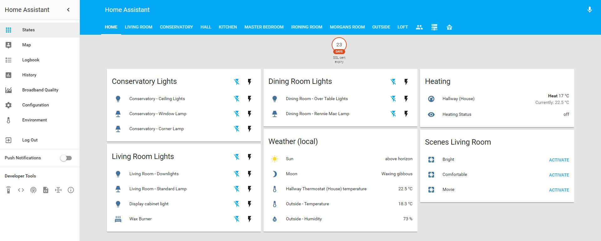

# Shortbloke's Home Assistant Configuration Files

This is my currently active set of configuration files for my [Home Assistant](https://home-assistant.io) running on Raspberry Pi.
If you are intested in following my progress be sure ⭐️ Star this github repository. 

I'm also starting to update [my blog](https://www.martinrowan.co.uk) more often sharing some of the things I'm learning along this journey.

These configuration files enable intgration with a wide range of systems through the power of Home Assistant.

### Configuration File Status
Each commit triggers a deployement to the latest homeassisatnt version with Python 3.4. This is done though TravisCI.

The current status of these project configuration files are: 

## Core Hardware of Home Assistant Hub
 - [Raspberry Pi 3 Model B](http://amzn.to/2hI9tyc) - Core control system, running Raspbian.
 - [RFXCOM RFXtrx433E](http://amzn.to/2wFwO63) - Enables RX/TX of 433Mhz signals over a range of protocols.
   - Note: Lots of different protocols in use on 433Mhz which may need to be enabled via a management utility. 433Mhz lacks any real security. If you capture the code you can control the device, as I found out by accidentally controlling a neighbour's plug-in sockets.
 - [Aeotec Z-Stick Gen5 (ZW090)](http://amzn.to/2wrrgwI) - Provides interface to Z-Wave Mesh Network devices.
 - Plus case, Power Supply and MicroSD Card.

## Devices controlled by Home Assistant
The following devices are controlled via my Home Assistant configurations. They may also provide sensors as input.
### Climate Control
 - [Nest Thermostat (3rd generation)](http://amzn.to/2umTkEp)
   - Home Assistant Component: [Nest](https://home-assistant.io/components/nest/) & related sub components
   - Provides: Temperature sensors and heating status information along with target temperature being able to be controlled via Home Assistant
   - Limitations:
     - Requires setup of a Nest Developer account (free)
     - Whilst 3rd gen Nest Thermostat in the UK provides the ability to control the hot water system. This isn't exposed via current implementation in Home Assistant.

### Power and Lighting control
 - [Lightwave RF Devices](https://www.lightwaverf.com)
   - Current devices in use:
     - Plug in sockets ([JSJSLW321](http://amzn.to/2vN1oys))
     - Inline Dimmer module ([JSJSLW831](http://amzn.to/2vLdcjH))
     - Smartphone Web Link - Hub ([JSJSLW930](http://amzn.to/2vLbJKq)) (Note: Not needed for Home Assistant Control)
   - Home Assistant Component: [RFXtrx](https://home-assistant.io/components/rfxtrx/) & related sub components
   - Provides: LightwaveRF devices provide an easy solution for retrofitting automation into existing homes. Many other technologies require for example both Live and Neutral to be present at light switches, which is uncommon for UK installations at least.
   - Limitation: One-Way communication, you can not query state to know devices status, nor can you confirm if commands sent were obeyed.
 - [TP-Link HS110 WiFi Smart Plug with energy monitoring](http://amzn.to/2vgQU8Q)
   - Home Assistant Component: [switch.tplink](https://home-assistant.io/components/switch.tplink/)
   - Provides: WiFi controlled plugin adapter with Energy monitoring. Enabling actions/automation to be triggered based on power usage. Similar to Belkin Wemo.
   - Limitations: Nothing significant so far. I now have 3 of these deivices to replace Wemo Insight Plugs. Hoping they last longer.
 - [Sonoff WiFi Relay Modules](http://sonoff.itead.cc/en/) (with modified hardware and firmware)
   - Current devices in use:
     - Inline 10A Relay ([Sonoff Switch](http://amzn.to/2xmjjIY))
     - Inline 16A Relay with temperature and humidity monitoring ([Sonoff TH16](http://amzn.to/2wiJKm0))
   - Modifications:
     - Hardware modified by solding headers onto Sonoff board to enable custome firmware updating. 
     - Custom Firmware to provide simple web configuration and control and MQTT support. Currently using [Sonoff-Tasmota](https://github.com/arendst/Sonoff-Tasmota) additional information  in the [project wiki](https://github.com/arendst/Sonoff-Tasmota/wiki)
   - Home Assistant Component: [MQTT Switch](https://home-assistant.io/components/switch.mqtt/)
   - Provides: Simple MQTT enabled wifi relay/switches and sensors at an incredibly low cost.
   - Limitations:
     - Need to open up devices and solder headers to flash custom firmware.
     - Need to flash custom firmware via [3.3V FTDI USB-to-Serial Converter/Programmer](http://amzn.to/2xlYJIw)
       - Be sure to set USB to serial programmer to **3.3V**, it may be 5V by default (mine was) and will likely kill the ESP8266 is you supply it with 5V.
     - Need to setup MQTT Broker on Raspberry Pi. I'm using Mosquitto. [Useful setup video](https://www.youtube.com/watch?v=AsDHEDbyLfg)
     - The TH16 Device is CE marked and having compared the design to the original switch, with a fuse and greater separation between High and Low voltage components. 
     - The Sonoff Basic switch is not CE certified, based onthe [CE Certification](https://www.itead.cc/wiki/File:CE_Certificate_for_Sonoff_Series.pdf) document. Caution should be used with this device.
 - [Flamerite Electric Fire](http://www.flameritefires.com/products/floor-standing-suites/junai.html)
   - Home Assistant Component: [switch.rfxtrx](https://home-assistant.io/components/switch.rfxtrx/)
   - Provides: Our famerite fire came with a 433Mhz remote control. The RFXCOM 433 Transceiver was able to detect the codes from the remote and allow Home Assistant to send the same codes
 - [Belkin Wemo Insight Switch, WiFi SmartPlug](http://amzn.to/2vMEtmN)
   - Home Assistant Component: [Wemo](https://home-assistant.io/components/wemo/)
   - Provides: WiFi controlled plugin adapter with Energy monitoring. Enabling actions/automation to be triggered based on power usage.
   - Limitations: 
     - Questionable reliability: I've had two now fail with similar symptoms when turning off devices which pull a considerable current, ~18kW. This is significantly less than the 13A/240V rated maximum. I've now removed all Wemo Insight Plugs from my home.
     - Setup problems: Early firmware versions had problems with setup, especially in environments with multiple access points.
     - No memory of last power state. In the event of a recovery from a power cut, the device connected will remain off.

### Media Players
 - [Sonos](http://www.sonos.com)
   - Home Assistant Component: [mediaplayer.sonos](https://home-assistant.io/components/media_player.sonos/)
   - Provides: Automatic detection of all Sonos Devices. Shows what is playing on each device. Able to control playback. Also able to be integrated with Text to Speech components.
 - [Plex](http://www.plex.tv)
   - Home Assistant Component: [mediaplayer.plex](https://home-assistant.io/components/media_player.plex/)
   - Provides: Shows activity of Plex Clients.
 - [Samsung Smart TVs](http://www.samsung.com/uk/tvs/all-tvs/)
   - Home Assistant Component: [mediaplayer.samsungtv](https://home-assistant.io/components/media_player.samsungtv/)
   - Provides: Discovery component will automatically detect TVs, report status and can be controlled via component.
   - Limitations: Not all Smart TV models are fully supported.
 - [Apple TV](https://www.apple.com/uk/tv/)
   - Home Assistant Component: [Apple_tv](https://home-assistant.io/components/apple_tv/) & related sub components 
   - Provides: (Only tested personally tested with Gen3 version) Shows what is playing on AppleTV with device controls. Plus provides access to a remote control.

## Sensors providing data to Home Assistant (input only)
### Voice Control 
 - [Amazon Echo Dot (2nd Generation)](http://amzn.to/2unxhgz)
   - Home Assistant Component: [Emulated Hue](https://home-assistant.io/components/emulated_hue/)
   - Provides: Voice control input to Home Assistant

### Hardware sensors
 - [Nest Protect (2nd generation) Smoke and Carbon monoxide detectors](http://amzn.to/2wFGOw4)
   - Home Assistant Component: [Nest](https://home-assistant.io/components/nest/) & related sub components
   - Provides: Monitoring of Smoke and CO2 alarms and system health.
   - Limitations: Requires setup of a Nest Developer account (free)
 - Z-Wave Devices:
   - [Aeotec Multisensor 6 (ZW100)](http://amzn.to/2vkpCNo)
     - Home Assistant Component: [z-wave](https://home-assistant.io/components/zwave/) plus sub components
     - Provides: A range of movement, light, temperature, humidity sensors in a single device. Has battery or USB power options. Note that when  USB powered device acts as a Z-Wave repeater in the mesh.
     - Limitations:
       - Setup may take multiple attempts. Watch [BRUH Z-Wave Video](https://www.youtube.com/watch?v=ajklDCaOGwY) to learn before attempting setup.
   - [Fibaro Gen 5 Multisensor (FGMS-001-ZW5-UK)](http://amzn.to/2wrJK0g)
     - Home Assistant Component: [z-wave](https://home-assistant.io/components/zwave/) plus sub components
     - Provides: A range of movement, light and temperature sensors in a single battery powered device.
     - Limitations:
       - Setup may take multiple attempts. Watch [BRUH Z-Wave Video](https://www.youtube.com/watch?v=ajklDCaOGwY) to learn before attempting setup.
       - No humidity sensor
       - Battery only, which means it goes to sleep a lot to save power. Currently testing in parallel to see if that really matters.
 - A range of other 433Mhz devices:
   - Home Assistant Component: [RfxTrx](https://home-assistant.io/components/rfxtrx/)
   - Device: Owl Energy Monitor
     - Note: Still being investigated
   - Device: Internal Temperature and Humidity monitors [WH5](http://www.ebay.co.uk/itm/Extra-Sensor-for-Weather-Station-with-temp-humidity-f-cast-base-Baro-press/261788376051)
     - Note: Temperature readings from WH5 are 40 DegC higher than they should be. This can be corrected by use of a template i.e. `value_template: '{{ (states.sensor.temp_humid_1_temperature.attributes["Temperature"] | float - 40) | round(1) }}'`
     - Research page: [Glen Pitt-Pladdy Blog](https://www.pitt-pladdy.com/blog/_20131228-233456_0000_Imagintronix_Temperature_Humidity_Sensor_Protocol_WH15B_for_WH1400_/)
   - Device: External Temperature and Humidity sensor, Oregon THGN132N
     - Note: Seems to work well, no special template required.
 - HP ILO sensor information
   - Home Assistant Component: [HP_ilo](https://home-assistant.io/components/sensor.hp_ilo/)
   - Provides: Sensor information for HP Servers with ILO such as overall health, temperature at specific points in the chassis.

### Software sensors
 - [Sun](https://home-assistant.io/components/sun/) - Provides details on sun position, enabling automation to be triggered, e.g. at dusk and dawn.
 - [Moon](https://home-assistant.io/components/sensor.moon/) - Provides details on the phase of the moon.
 - [System Monitor](https://home-assistant.io/components/sensor.systemmonitor/) - Provides information on the host system Home Assistant is running on.
 - [Home Assistant SSL Certificate Expiry Checking](https://home-assistant.io/docs/ecosystem/certificates/lets_encrypt/#7---set-up-a-sensor-to-monitor-the-expiry-date-of-the-certificate) - Provides a sensor to show the number of days until the current certificate in use expires. So that it can be renewed before it expires.

### Location Tracking
 - iOS App - [Home Assistant App](https://itunes.apple.com/us/app/home-assistant-open-source-home-automation/id1099568401)
   - Home Assistant 3rd Party Addon: [ios](https://home-assistant.io/docs/ecosystem/ios/)
   - Note: Also provides complete control of HASS, iPhone battery monitoring and is able to receive notifications from HASS.

# Other features being experimented with:
 - TTS (Text To Speech) via Google_SAY (configured not in use)
 
# Automation Scripts
 - Turning on lights an hour before sunset
 - Turning off power sockets if no movement detected for 30 mins and sockets drawing more than just standby power levels. Triggers notification when sockets are turned off.
 - Send notification when Let's Encrypt SSL certificate used for HomeAssistant has less than 3 weeks left before expiry.
 - Automatically syncs down changes from github on sucessful travisCI build and restarts Home Assistant

# Additional Info
Private information is stored in secrets.yaml (not uploaded)

# Config updating and validation
 - Changes to configuration are pushed to git using `gitupdate.sh` script.
 - TravisCI is connected to this repository, which will run a script validation for each check-in automatically. Setup as per: https://home-assistant.io/docs/ecosystem/backup/backup_github/
   - Note in order for Travis to work a number of extra files are required:
     - `travis_secrets.yaml` - Contains dummy values for the secrets used in the configuration files
     - `travis.fake_ssl_key` and `travis.fake_ssl_crt` - Are dummy files needed for a Home Assistant configuration setup to use SSL.
 - A successful Travis build triggers a git pull request to upload the current configuration, followed by restarting the home assistant service. Thus, enabling changes to be made away from the the Pi/HASS Hub, uploaded to GitHub and directly applied to the running system.

# Backups
I've implemented a simple backup plan which uses a windows file share on my Microserver to backup my Home Automation system. It provides:
 - Weekly and Monthly full SD card backups
 - Daily and Weekly HASS MySQL Database backups
 - Daily and Weekly backup of .homeassistant directory, which contains running config and dependancies.
This is driven my crontab. For more information [read these notes](https://github.com/shortbloke/home_assistant_config/issues/3)
