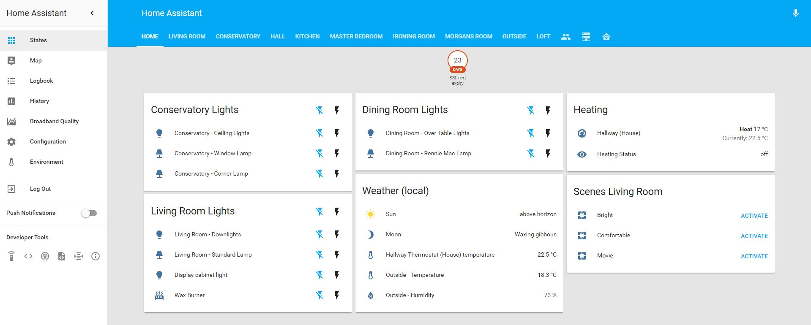

# Shortbloke's Home Assistant Configuration Files

This is my currently active set of configuration files for my [Home Assistant](https://home-assistant.io) running on Raspberry Pi.
If you are interested in following my progress be sure ⭐️ Star this repository and check out [my blog](https://www.martinrowan.co.uk).

## Configuration Organisation

I've limited the contents of configuration.yaml and utilised [packages](https://www.home-assistant.io/docs/configuration/packages/) to provide some grouping, in order to make it easier to understand and maintain.

Packages provide a simple way to encapsulate the configuration for a given integration or device. Rather than updating many different files, related changes are kept in a single package.

## Core Hardware of Home Assistant Hub

- [Raspberry Pi 5 (4 GB RAM)](https://amzn.to/3OMiOCc) - Core control system, running [Home Assistant OS](https://www.home-assistant.io/installation/raspberrypi/).
  - Boots directly from a 250 GB WD Blue NVMe drive without an SD card.
- [Argon ONE V5](https://www.martinrowan.co.uk/2026/08/migrating-home-assistant-to-argon-one-v5/) - Encloses the Raspberry Pi, NVMe storage, OLED status display and Zigbee coordinator.
  - The OLED cycles through CPU, storage, memory, temperature, fan-speed and network information.
  - The case fan is controlled through the Raspberry Pi fan header, with its current speed exposed to Home Assistant.
- [Argon Industria Zigbee Module](https://argon40.com/en-gb/products/argon-industria-v5-zigbee-module) - Internal Texas Instruments CC2652 coordinator used by the Zigbee Home Automation integration. The existing Zigbee network was migrated from the former Nortek USB coordinator without re-pairing its devices.
- [RFXCOM RFXtrx433E](http://www.rfxcom.com/store/Transceivers/14103) - Enables reception and transmission of 433 MHz signals over a range of protocols.
  - Note: The required 433 MHz protocols may need to be enabled with a management utility. These devices lack meaningful security; capturing a code can allow another transmitter to control the device.

## More Information

- [Devices controlled and sensors monitored](devices.md)
- [Automations and scripts](automations.md)

**Note: Private information is stored in secrets.yaml (not uploaded)**
